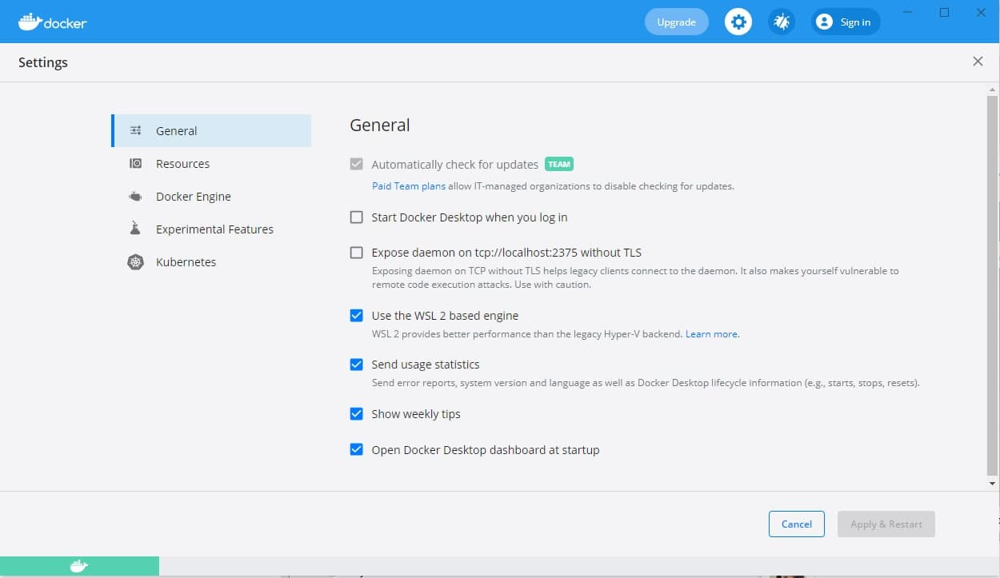
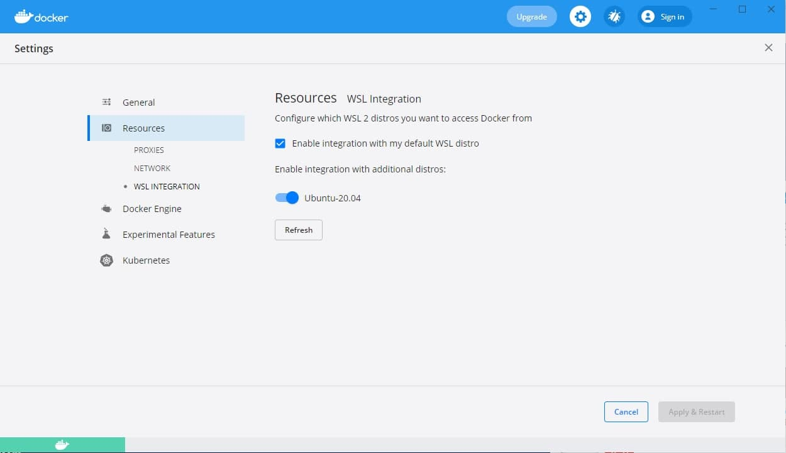

# Тестовое задание на основе Docker и Laravel для Frontend разработчика

## Первоначальная настройка

-   Устанавливаем Docker c [официального сайта](https://www.docker.com/products/docker-desktop) и [Docker Compose](https://docs.docker.com/compose/install/)
-   Для пользователей Windows дополнительно необходимо установить вирутальное ядро Linux
    -   Скачиваем с официального сайта необходимый [пакет](https://wslstorestorage.blob.core.windows.net/wslblob/wsl_update_x64.msi)
    -   Устанавливаем пакет
    -   Запускаем Powershell и выполняем команду `wsl --set-default-version 2`
    -   Устанавливаем из Microsoft Store [Ubuntu](https://www.microsoft.com/store/apps/9n6svws3rx71)
    -   Запускаем настройку Ubuntu из пуска, задаем имя пользователя и пароль
    -   Настраиваем Docker:
        -   Запускаем Docker Desktop и переходим в настройки 
        -   Во вкладке General включаем 'Use the WSL 2 based engine'
        -   Сохраняем настройки
        -   Переходим во вкладку Resources 
        -   Выбираем раздел WSL Integration
        -   Включаем свеже устрановленный образ Ubuntu
        -   Сохраняем настройки
-   Собираем контейнер командой в папке проекта `docker-compose up -d`
-   Инициализируем сервер
    -   при запущенном контейнере в папке проекта запускаем команду `docker-compose exec app bash`
    -   запускаем сборку `sed -i 's/\r$//' init.sh`, затем `bash ./init.sh`

## Сборка демо проекта

-   при запущенном контейнере в папке проекта запускаем команду `docker-compose exec app bash`
-   собираем js `yarn dev`

## Описание API

| Описание                        | Тип запроса |             Структура |                      Параметры |
| ------------------------------- | :---------: | --------------------: | -----------------------------: |
| Получить все комментарии        |     GET     |      `/api/comments/` |                                |
| Получить конкретный комментарий |     GET     | `/api/comments/${id}` | id - идентификатор комментария |
| Создать комментрай              |    POST     | `/api/comments/`      |                                |
| Удалить комментарий             |   DELETE    | `/api/comments/${id}` | id - идентификатор комментария |
| Обновить комментарий            |    PATCH    | `/api/comments/${id}` | id - идентификатор комментария |

## Описание записи

`{ name: 'Имя создателя', text: 'Текст комментария', date: 'Дата создания комментраия в строковом формате(выбирается создателем)', }`

## Задание

Создать сайт со списком комментариев.

Функциональные требования:

-   добавление/ удаление комментариев (без перезагрузки страницы)
-   постраничный просмотр комментариев (3 комментария на страницу)
-   сортировка по id и дате добавления в обе стороны
-   сортировку и пагинацию необходимо реализовать на фронте
-   для реализации использовать готовый пакет для vue2 (datapicker) установиться при настройке проекта, для реализации работы можно использовать axios

Требование к разработке:

-   использование адаптивной верстки
-   использование js-фреймворка vue
-   загрузка комментариев по ajax
-   использовать vuex и реализовать возможность менять сортировку на клиенте.

Форма добавления комментария должна располагаться под уже добавленными комментариями.

## Код размещается в папке:

`resources/js/`
